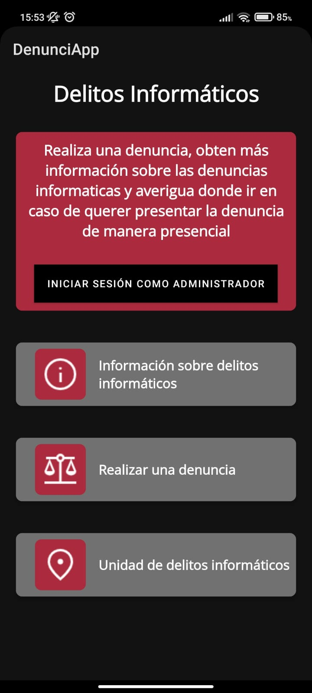

# Classifier-Complaints
You submit a complaint through the app, and it classifies it as either related to informatics or not.

The model.py file contains the entire artificial intelligence model, which utilizes various functionalities of scikit-learn.

The provided code performs the classification of legal and informatics complaints using machine learning techniques. Here is a detailed description of the code and its functionality.
Library Importation:
The code begins by importing the necessary libraries for its execution, including pandas, seaborn, matplotlib.pyplot, numpy, spacy.lang.es, sklearn, and io.

# Data Loading:
Next, the code loads the data from two CSV files, "denuncias_inf.csv" and "denuncias_LEG.csv," using the pd.read_csv() function from the pandas library. The data is stored in two variables, datos_inf and datos_LEG, respectively.

# Data Manipulation:
Several manipulations are performed on the loaded data to prepare it for model training. Additional columns such as "tipo" (type) and "category_id" are added to the legal and informatics complaint data. The concat() function from pandas is used to combine the data from both types of complaints into a single dataframe called df. Additionally, rows containing missing values in the "Denuncias" column are removed using the notna() function.

# Feature Creation:
Next, the TF-IDF vectorizer from the sklearn library is used to convert the complaint texts into numeric feature matrices. An instance of TfidfVectorizer is created with various custom parameters such as minimum word frequency, n-gram range, and Spanish stop words. The vectorizer is applied to the "Denuncias" column of the df dataframe using the fit_transform() function. The result is stored in the variable features.

# Exploratory Data Analysis:
The code performs exploratory data analysis using the seaborn and matplotlib libraries. A bar plot is generated to show the count of complaints by type ("tipo") using the groupby() and plot.bar() functions of pandas.

# Variable Definition:
Several variables are defined that will be used later in the code. These variables include category_id_df, category_to_id, id_to_category, and labels, which contain information about the complaint categories and labels.

# Definition of Custom Vocabularies:
The code defines custom vocabularies using the TF-IDF vectorizer for legal and informatics complaints. These vocabularies are used to generate specific feature matrices for each type of complaint. The feature matrices are calculated using the fit_transform() function of the TF-IDF vectorizer and stored in the variables legal_features and informatica_features, respectively.

# Calculation of Chi-square Value:
The chi-square value (chi2) is calculated for legal and informatics complaints using the chi2() function from the sklearn library. The chi-square value is used to determine which terms are most correlated with each type of complaint.

# Function to Print Most Correlated Terms:
The code defines a function called print_most_correlated_terms() that prints the most correlated terms for each type.

# In addition to the Python code, there is also a mobile app.
Overview of the Project: Documentation of the Informatics Complaints Registration Application

The Informatics Complaints Registration application is a tool designed to facilitate the process of registering and classifying complaints related to informatics crimes. The application connects to an API that classifies complaints as informatics or non-informatics. The complaint data is stored in a database, and administrative users can access it through the administration interface.

# Project Structure

## The project consists of the following main components:

ActivityMain.java: This class represents the main activity of the application. It contains buttons for creating a database, logging in, submitting a complaint, and accessing additional information.

NuevoActivity.java: This class is responsible for registering complainant data, such as name, last name, identification document, email, and phone number.

NuevoActivity2.java: This class registers the data of the accused, including name, last name, identification document, phone number, and the reported incident. It also communicates with an API to classify the text of the reported incident.

API: The API is a web service that receives the text of the reported incident and classifies it as informatics or non-informatics using a text classification model.

Modelo.py: This file contains the text classification model used by the API. It utilizes natural language processing techniques to classify the text into categories.

# Main Functionalities
## The Informatics Complaints Registration application offers the following main functionalities:

Complainant Registration: Users can register complainant data, such as name, last name, identification document, email, and phone number.

Accused Registration: Users can register accused data, including name, last name, identification document, phone number, and the reported incident.

Complaint Classification: The application communicates with an API that classifies the text of the reported incident as informatics or non-informatics.

Database Storage: Complaint data, along with its classification, is stored in a database for future retrieval.

Access to Registered Complaints: Administrative users can access all registered complaints through the administration interface.

Project Objectives
Facilitate Complaint Registration: The project aims to simplify and expedite the process of registering informatics complaints, allowing citizens to submit their cases quickly and easily. This will be achieved through an intuitive and user-friendly interface that guides users in entering the required information.

Automated Complaint Classification: The system will implement an automated complaint classification functionality using natural language processing techniques and a text classification model. This will help identify whether a complaint is related to an informatics crime or not, providing an initial classification that will assist the Informatics Crimes Unit in prioritizing and managing cases.

Main Components and their Functionality

The main components of this application are defined in Java files. Firstly, we have the Main_activity.Java file, which serves as the central hub for user interactions. From the main activity, users can access more information about informatics crimes, register as administrators to view all records saved in the database, and obtain information about the Informatics Crimes Unit in Paraguay. Each of these interactions within the application corresponds to a new Java file and a new XML file. Additionally, we have two essential files in our application: NuevoActivity and NuevoActivity2. These files handle the registration process for the complainant and the accused, respectively.

In the NuevoActivity2 file, the connection to the modelo.py API is established. This is where the user submits the complaint, and it is sent to the app.

Technologies Used

Programming Language: Java and Python.

Framework: Android and Scikit-learn.

Additional Libraries and Tools Used: numpy, pandas, matplotlib, scipy, Retrofit (for Java) to connect to the API.

# image 

That is the image of the Movile app that we develop for this proyect
